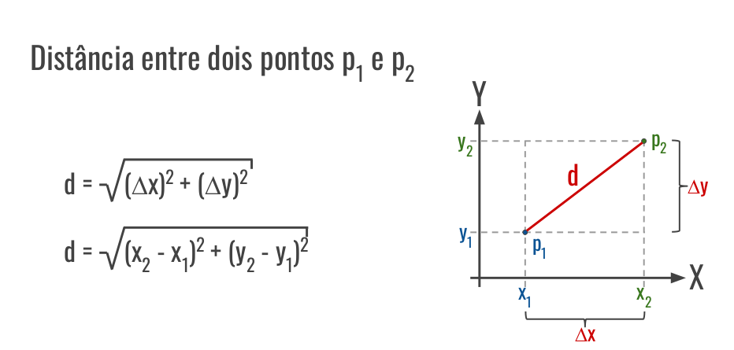
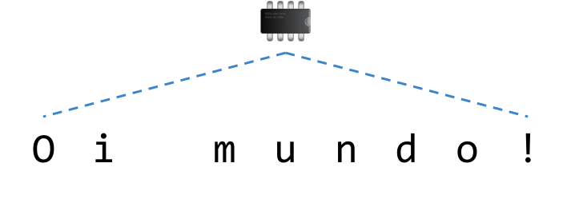
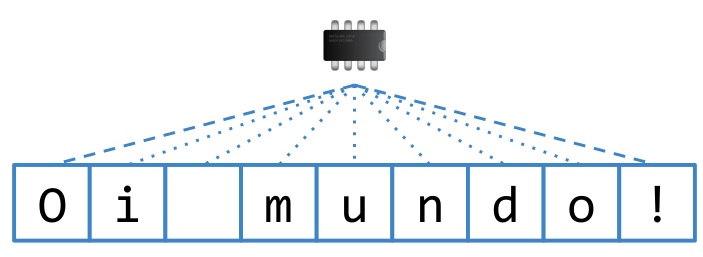
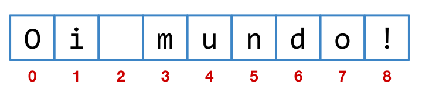
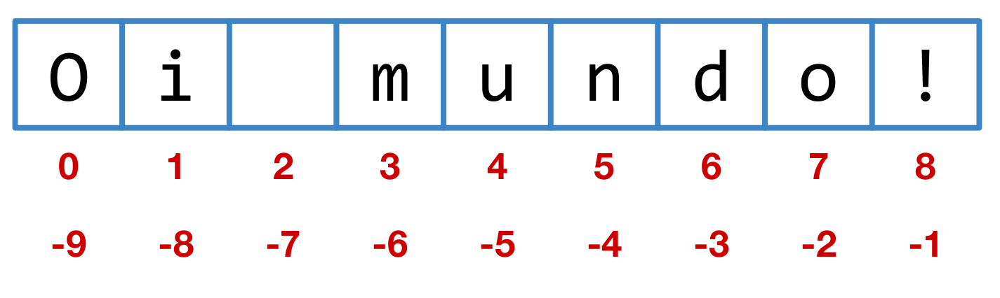

# Introdução à Programação
__*Aula 03*__
## Entrada e Saída de Dados
***

#### Agenda 
* Entrada de Dados 
* Saída de Dados
* Manipulção de Textos
***

# Entrada de Dados

#### Função de entrada
```
valorEntrada = input('Informe um valor: ')
```
***

#### Exemplos de entradas de dados
```
nome = input('Qual o seu nome? ')
peso = int(input('Qual o seu peso? '))
altura = float(input('Qual a sua altura? '))
print(nome, peso, altura)
```
***

# Saída de Dados

#### Função de saída
```
print('valor de saída')
```
***

#### Exemplos de saídas de dados
```
print('Oi mundo!')
print(2 + 5)
print('2' + '5')
print('Oi', 5)
```
***

#### Exemplos de saídas de dados
```
# Exibe uma mensagem de boas-vindas na tela
print("Bem-vindo ao meu programa!")
# Realiza uma operação matemática e exibe o resultado
a = 10
b=5
resultado = a * b
print("O resultado da operação é:", resultado)
``` 
***

#### Comentários
* Sevem para documentar o código-fonte.
* Comentários em Python iniciam com o caractere hash (jogo da velha).
  
‘’’Use isso para comentar seu programa’’’
***

#### Comentários
* Também é possível utilizar aspas triplas para especificar comentários de várias linhas.
 
‘’’Assim é possível comentar um programa. Esse comentário pode ser de múltiplas linhas.’’’
***

## Exercício 1
Escreva um programa que peça ao usuário para **digitar seu nome e imprima** uma mensagem de saudação na tela.
***

## Exercício 2
Escreva um programa que peça ao usuário para digitar dois números e imprima o resultado das **operações aritméticas básicas**.
***

## Exercício 3
Escreva um programa que peça ao usuário para digitar a sua altura e peso e imprima o seu **IMC (Índice de Massa Corporal)** na tela. **IMC = peso / (altura2)**.
***

## Exercício 4
Crie um programa que leia quanto de **dinheiro** uma pessoa possui e mostre quantos Dólares ela pode comprar. Taxa cambial: * US$ 1.00 = R$ 4,89
***

## Exercício 5 
Escreva um programa que transforme uma **temperatura** digitada em °C (Celsius) em °F (Fahrenheit).
***

## Exercício 6
Escreva um programa que leia 2 pontos num plano e imprima a distância entre eles:
* p1 = (x1, y1)
* p2 = (x2, y2)
***


***

# Manipulação de Textos

#### Strings ou cadeias de caracteres
* Sequências de caracteres utilizadas para representar palavras, frases ou textos em um programa.
***

#### Exemplos de strings
* 'João'
* "Verde"
* 'Oi mundo!'
* 'Informe um nome: '
* '''Ocorreu um erro durante a execução do programa'''
***

#### Aspas simples e aspas duplas
```
print("d'água")
print('Oi "pessoal"!')
print('d\'água') # Use \' para escapar da aspa
print("Oi \"pessoal\"!")
print('Caminho: c:\windows')
```
***

#### Quebra de linha e texto puro (raw)
```
texto = 'Primeira linha.\nSegunda linha.'
print(texto)
print(r'c:\novaPasta')
```
#### Strings literais
```
print("""\
Use: programa [opção] [arg]
Opções e argumentos:
-h : imprime essa mensagem de ajuda.
-i
: ignora as mensagens de saída.
arg : argumentos passados para o programa.
""")
```
***

#### Concatenação e repetição
```
print(2 * 'oi ' + 'Pessoal' + 3 * '!')
texto = ('Ponha vários textos nos parênteses '
'e eles serão unidos em uma única string.')
print(texto)
```
***

#### Strings ou cadeias de caracteres

***

#### Strings ou cadeias de caracteres

***

#### Índices

***

#### Posições

```
texto = 'Oi mundo!'
print(texto)
```

#### Posições

```
texto = 'Oi mundo!'
print(texto) #Imprime todo o texto
------------------
Oi mundo!
```
***

#### Posições

```
texto = 'Oi mundo!'
print(texto[0]) 
```
***

#### Posições

```
texto = 'Oi mundo!'
print(texto[0]) #Imprime a primeira posição
------------------
O
```
***

#### Posições

```
texto = 'Oi mundo!'
print(texto[8])
```
***

#### Posições

```
texto = 'Oi mundo!'
print(texto[8]) #Imprime a posição 8
------------------
!
```
***

#### Posições

***

#### Posições

```
texto = 'Oi mundo!'
print(texto[-1]) 
```
***

#### Posições

```
texto = 'Oi mundo!'
print(texto[-1]) #Imprime a última posição 
------------------
!
```
***

#### Posições

```
texto = 'Oi mundo!'
print(texto[-3])
```
***

#### Posições

```
texto = 'Oi mundo!'
print(texto[-3]) #Antepenútima posição 
------------------
d
```
***

#### Fatiando o texto

```
texto = 'Oi mundo!'
print(texto[0:4])
```
***

#### Fatiando o texto

```
texto = 'Oi mundo!'
print(texto[0:4]) #Imprime da posição 0 a (4-1)
------------------
Oi m
```
***

#### Fatiando o texto

```
texto = 'Oi mundo!'
print(texto[3:8])
```
***

#### Fatiando o texto

```
texto = 'Oi mundo!'
print(texto[3:8]) #Imprime da posição 3 a (8-1)
------------------
mundo
```
***

#### Fatiando o texto

```
texto = 'Oi mundo!'
print(texto[:2])
```
***

#### Fatiando o texto

```
texto = 'Oi mundo!'
print(texto[:2]) #Inicio até posição (2-1)
------------------
Oi
```
***

#### Fatiando o texto

```
texto = 'Oi mundo!'
print(texto[3:]) 
```
***

#### Fatiando o texto

```
texto = 'Oi mundo!'
print(texto[3:]) #Posição 3 até fim 
------------------
mundo!
```
***

#### Dividindo o texto

```
texto = 'Oi mundo!'
palavras = texto.split('')
print(palavras) 
```
***

#### Dividindo o texto

```
texto = 'Oi mundo!'
palavras = texto.split('') #Divide o texto.Separador ''
print(palavras)
------------------
['Oi','mundo!']
```
***

#### Dividindo o texto

```
texto = 'Oi mundo!'
palavras = texto.split('') #Divide o texto.Separador ''
print(palavras[0])
```
***

#### Dividindo o texto

```
texto = 'Oi mundo!'
palavras = texto.split('') #Divide o texto.Separador ''
print(palavras) # Primeira palavra
------------------
Oi
```
***

#### Tamanho ou comprimento (lenght)

```
texto = 'Oi mundo!'
tamanho = len(texto)
print(tamanho)
```
***

#### Tamanho ou comprimento (lenght)

```
texto = 'Oi mundo!'
tamanho = len(texto) #Obtém o tamanho
print(tamanho)
------------------
9
```
***

#### Índice do texto fora de alcance
```
texto = 'Oi mundo!'
print(texto[50])
-------------------------------------
Traceback (most recent call last):
File "<pyshell#0>", line 1, in <module>
print(texto[50])
IndexError: string index out of range
```
***

#### Índices imutáveis

```
texto = 'Oi mundo!'
texto = 'M'
```
***

#### Índices imutáveis

```
texto = 'Oi mundo!'
texto = 'M' #Tentando alterar a posição 3
-------------------------------------
TypeError: 'str' object does not support item assignment
```
***

#### Modificando uma string

```
texto = 'Oi mundo!'
novoTexto = texto[:3] + 'pessoal' + texto[:8]
print(novoTexto)
```
***

#### Modificando uma string

```
texto = 'Oi mundo!'
novoTexto = texto[:3] + 'pessoal' + texto[8:]
print(novoTexto)
------------------
'Oi pessoal!'
```
***

#### Modificando uma string

```
texto = 'Oi mundo!'
texto = texto.replace('mundo', 'pessoal')
print(texto)
```
***

#### Modificando uma string

```
texto = 'Oi mundo!'
texto = texto.replace('mundo', 'pessoal')
print(texto)
------------------
'Oi pessoal!'
```
***

#### Analisando uma string

```
texto = 'Oi mundo!'
print(texto.count('m'))
```
***

#### Analisando uma string

```
texto = 'Oi mundo!'
print(texto.count('m')) # Quantidade de m
------------------
1
```
***

#### Analisando uma string

```
texto = 'Oi mundo!'
print(texto.find('m'))
```
***

#### Analisando uma string

```
texto = 'Oi mundo!'
print(texto.find('m')) # Posição de m
------------------
3
```
***

#### Analisando uma string

```
texto = 'Oi mundo!'
print('nd' in texto)
```
***

#### Analisando uma string

```
texto = 'Oi mundo!'
print('nd' in texto) # 'nd' está presente no texto?
------------------
True
```
***

#### Transformando uma string
```
turma = 'Fundamentos de Programação'
print(turma.upper())
print(turma.lower())
print(turma.capitalize())
print(turma.title())
```
***

#### Outras funções
* Na **documentação** é possível encontrar outras funções para
manipular strings.
* Exemplo:
    * rfind(**s**) - encontra a última posição de **s**.
***

#### Formatação de Strings
```
nome = 'Fundamentos de Programação'
qtd = 12
print('A turma de {} possui {} alunos.'.format(nome,qtd))
print(f'A turma de {nome} possui {qtd} alunos.')
```
***

## Exercício 
Faça um programa que leia o **nome completo** de uma pessoa e mostre na tela o primeiro e o último nome. Os nomes devem ter a primeira letra maiúscula e as demais minúsculas.
***

## Exercício 8
Desenvolva um programa que leia um texto e imprima-o de **trás pra frente**.
***

## Exercício 9
Escreva um programa que pergunte a quantidade de hóspedes e por quantas diárias eles ficarão no hotel. Calcule o valor da hospedagem, sabendo que a diária custa R$ 60 para o primeiro hóspede e R$ 20 por hóspede adicional.
***

## Exercício 10
Considere os seguintes valores: Diária: R$ 90,00 Transporte (trecho): R$ 5,00 Escreva um programa que solicite a quantidade de dias que um profissional irá trabalhar e calcule o custo total da mão-de-obra.
***

## Desafio 1
Desenvolva um programa que leia um texto e diga se ele é, ou não, um **palíndromo** (ignore os acentos e espaços). Exemplos:
* ROMA E AMOR
* APOS A SOPA
***

## Desafio 2
Escreva um programa que leia uma **data** no formato “15/03/2018” e informe se a data é inválida (valide também os anos bissextos). Se a data for válida, imprima no formato completo: “15 de março de 2018”.
***

## Desafio 3
Escreva um programa que leia um texto e imprima uma versão codificada ou decodificada dele. A **criptografia** deve ser boa. O usuário deve escolher a ação que deseja realizar.
***

### Extra
<span style= "color:red">Moneyball - O Homem que Mudou o Jogo</span>


Filme com Brad Pitt sobre como a ciência de dados (data science) pode contribuir com as tomadas de decisões.
***

## Encerramento
* Revisão 
* Exercício Complementar 
* Próxima Aula