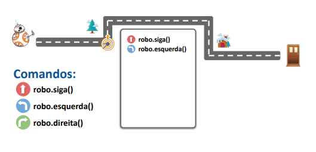
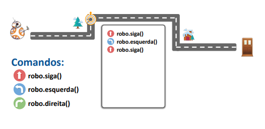
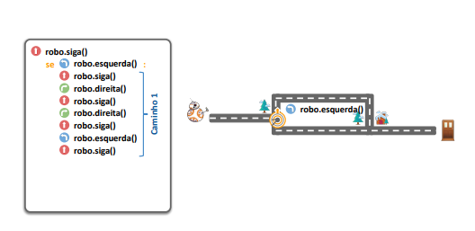

#  Introdução à Programação
#### Aula 04
## Estruturas de Controle Condicional
***
### Agenda
#### - - -

* Estrutura Condicional Simples
* Estrutura Condicional Composta
* Estrutura Condicional de Seleção Múltipla
***

***

***

***

***

***

***

***

***

***

***

***

***

***

***

***

***
# Estruturas Condicionais ou de Controle
***
## Estruturas de controle
Estruturas de controle são utilizadas para definir o
caminho que um programa deve seguir.
***

***

***

***

***
# Estrutura Condicional Simples
## Estrutura Condicional Simples
SE expressão verdadeira
FAÇA alguma operação

***
## Bloco de código
* No Python, as declarações são agrupadas conforme
a indentação.
* Declarações estão no mesmo nível se estiverem com
a mesma indentação
***
## Bloco de código
- **Nível 1**
  - **Nível 2**
    - **Nível 3**
    - **Nível 3**
  - **Nível 2**
- **Nível 1**
***
## Estrutura Condicional Simples
***
## if True:
 Executa o código localizado aqui. 
 ***
 ## Exemplo de Estrutura Condicional Simples

 #### Verifica se um número é par
 numero = int(input("Digite um número inteiro: "))

 if numero % 2 == 0:
print("O número digitado é par.")
***
## Exercício 1
Escreva um programa que
leia um número inteiro e
verifique se ele é positivo.
***
## Exercício 2
Escreva um programa que
leia uma idade em anos de
uma pessoa e verifique se
ela é maior de idade.
***

## Estrutura Condicional Composta
SE expressão verdadeira 

FAÇA alguma operação

SENÃO outra operação

if expressão lógica :

bloco de código

else :

bloco de código
***
## Exemplo de Estrutura Condicional Composta
Verifica se um número é positivo ou negativo
numero = int(input("Digite um número inteiro: "))

if numero > 0:

print("O número digitado é positivo.")

else:

print("O número digitado é negativo.")
***
## Exercício 3
Escreva um programa que
leia uma idade em anos de
uma pessoa e verifique se
ela é **menor de idade** ou se
é um **adulto**.
***
## Exercício 4
Escreva um programa que
leia um valor e verifique se
ele é **positivo ou negativo.**
***
## Exercício 5
Escreva um programa para
ler 2 valores e retornar o
**maior deles.**
Considere que não serão
informados valores iguais.
***
## Exercício 6
Escreva um programa que
leia um valor e verifique se
ele é **par ou ímpar.**
***
## Exercício 7
Escreva um programa que
verifique a validade de uma
senha fornecida pelo usuário.
A senha válida é: **pwd$357**
Devem ser impressas as
seguintes mensagens:
**ACESSO PERMITIDO**, caso a
senha informada seja válida;
ou
**ACESSO NEGADO**, caso a
senha informada seja inválida.
***
# Estrutura Condicional de Seleção Múltipla
***
## Estrutura Condicional de Seleção Múltipla

SE expressão verdadeira
FAÇA alguma operação

SENÃO, SE expressão verdadeira
FAÇA outra operação

SENÃO mais outra operação

if expressão lógica :
bloco de código

elif expressão lógica :
bloco de código

else :
bloco de código
***
## Exemplo de Estrutura Condicional Composta
Verifica se um número é positivo, negativo ou zero

    numero = int(input("Digite um número inteiro: "))

if numero > 0:

    print("O número digitado é positivo.")

elif numero < 0:

    print("O número digitado é negativo.")

else:

    print("O número digitado é zero.")
***
## Outro Exemplo de Estrutura Condicional Composta
linguagem = input("Informe uma linguagem de programação: ")

    if linguagem == "javascript" :
    print("desenvolvedor frontend")

    elif linguagem == "java" :
    print("desenvolvedor backend")

    elif linguagem == "c" :
    print("desenvolvedor de software embarcado")

    elif linguagem == "python" :
    print("analista de dados")
    …
    else:
    print("programador")
    
***
# Exercício 8 
Escreva um programa que
leia **três números inteiros**
e imprima na tela o **maior**
deles.
***
# Exercício 9

Crie um programa que leia
a nota de um aluno e
informe se ele foi:
* Aprovado: ≥ 7;
* Reprovado: < 5;     ou
* Ficou de Final: ≥ 5 e < 7
***
# Exercício 10
Escreva um programa que
leia a idade de uma pessoa e
verifique em qual categoria
ela se enquadra: **criança** (até
12 anos), **adolescente** (de 13
a 17 anos) ou **adulto** (a partir
de 18 anos).
Imprima a categoria
correspondente na tela.
***

# Exercício 11
Faça um programa que
pergunte em que turno você
estuda. Peça para digitar:
* **M**, para matutino;
* **T**, para vespertino; ou
* **N**, para noturno.

Imprima a mensagem **“Bom
dia!”** , **"Boa tarde!"** , **“Boa
Noite!”** ou **“Valor inválido**”,
conforme o caso. 
***
# Exercício 12
Escreva um programa que
imprima o nome completo
da Unidade da Federação,
ou "Valor inválido":
* **CE**, para Ceará;
* **BA**, para Bahia;
* **SP**, para São Paulo;
* etc.
  ***
## match-case (switch)
    linguagem = input("Informe uma linguagem de programação: ")

    match linguagem :
        case "javascript" :
            print("desenvolvedor frontend")
        case "java" :
            print("desenvolvedor backend")
        case "c" :
            print("desenvolvedor de software embarcado")
        case "python" :
            print("analista de dados")
        case _ :
            print("programador")
***
# Exercício 13
Faça um Programa que leia
um número e exiba o dia
correspondente da
**semana:**
* 1, para Domingo;
* 2, para Segunda;
* etc.

Se digitar outro valor deve
aparecer “Valor inválido“.
***
# Exercício 14

Desenvolva um programa que
realize as 4 operações
matemáticas básicas. A
entrada para a escolha da
operação é dada da seguinte
forma:
1. Soma
2. Subtração
3. Multiplicação
4. Divisão
***
# Desafio 1
Crie um programa que
calcule o **IMC** a partir dos
valores digitados (peso e
altura) e informe a situação
conforme tabela a seguir.

# Encerramento 
* Revisão
* Exercício Complementar
* Próxima Aula
