# Introdução à Programação
__*Aula 05*__
## Estruturas de Repetição 
***

#### Agenda
* Estrutura Com Número Fixo de Repetições
* Estrutura de Repetição Com Teste no Início
* Estrutura de Repetição Com Teste no Final
***

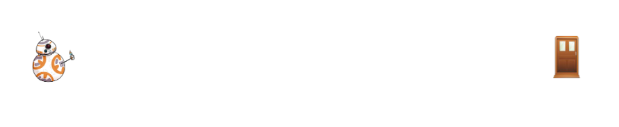
***

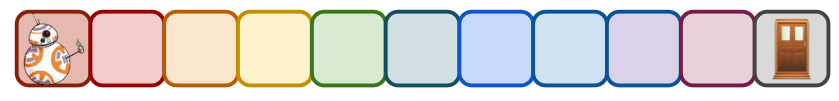
***

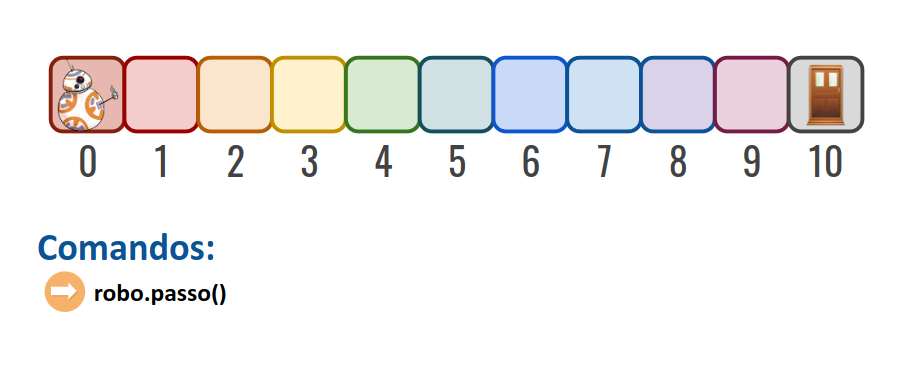
***

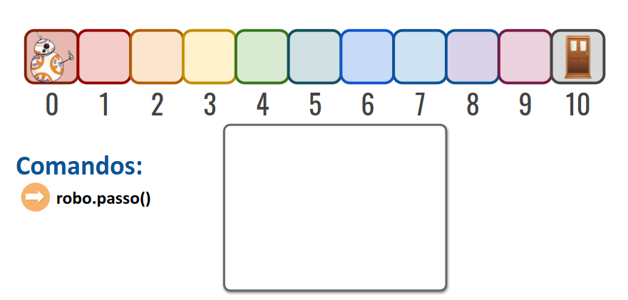
***

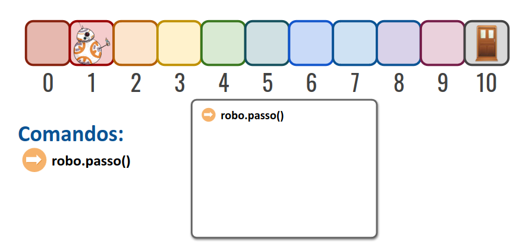
***

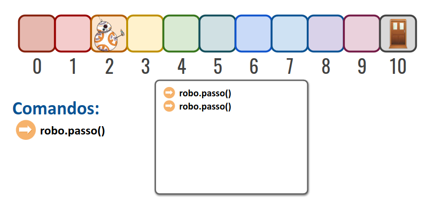
***

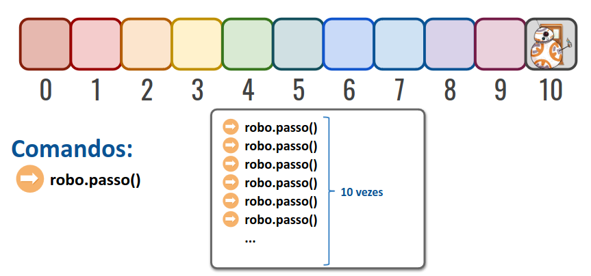
***

# Estruturas de Repetição

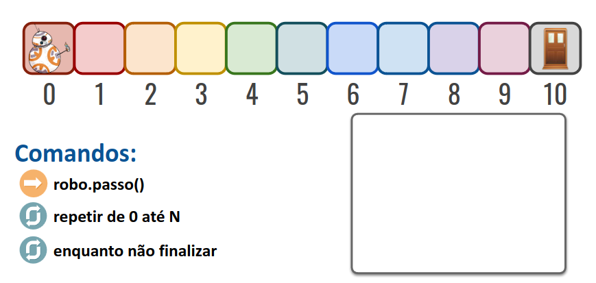
***

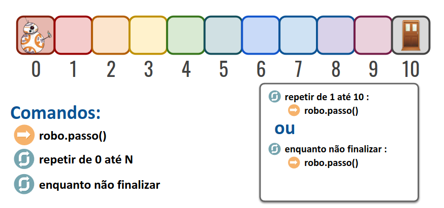
***

# Estrutura Com Número Fixo de Repetições
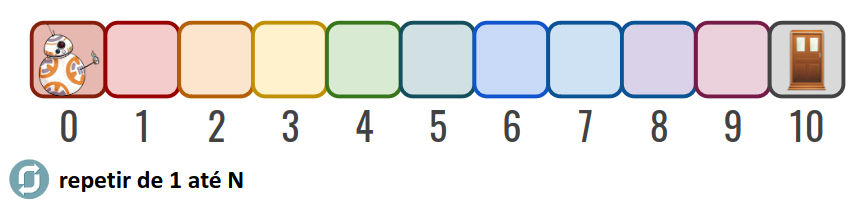

* Laço com variável de controle
***


* Laço com variável de controle: <span style = "color:red"> usa quando se sabe a quantidade de passos.</span>
***

#### Centro de Referência
```
for c in range(início, fim) :
# Executa o código localizado aqui.
```

#### Exemplo de Estrutura Com Número Fixo de Repetições
```
# Imprime os números de 1 a 5 utilizando um loop for
for i in range(1, 6):
    print(i)
```

#### Imprimindo na mesma linha
```
# Imprime os números de 1 a 5 utilizando um loop for
for i in range(1, 6):
print(i, end=' ')
```
***

#### Repetindo uma ação N vezes
```
n = int(input('Digite um valor: '))
for c in range(0, n) :
    print(c)
```
***

#### Pulando passos
```
inicio = int(input('Início: '))
fim = int(input('Fim: '))
incremento = int(input('Passo: '))
for c in range(inicio, fim + 1, incremento) :
    print(c)
```
***

#### De trás para frente
```
for c in range(10, 0, -1) :
    print(c)
```
***

#### Incrementando valores
```
soma = 0
for c in range(0, 4) :
    n = int(input('Informe um valor: '))
    soma += n
print('Somatório dos valores é {}.'.format(soma))
```
***

## Exercício 1
Escreva um programa que imprima os números de 1 a 10 em **ordem crescente**.
***

## Exercício 2
Escreva um programa que imprima os números de 1 a 10 em **ordem decrescente**.
***

## Exercício 3
Escreva um programa que imprima a **soma dos números** de 1 a 100.
***

## Exercício 4
Escreva um programa que imprima a **soma dos números pares** de 1 a 100.
***

## Exercício 5
Crie um programa que leia a velocidade registrada em **10 fotosensores** e informe se a **velocidade média** está acima do limite estabelecido (60 km/h).
***

# Estrutura de Repetição Com Teste no Início

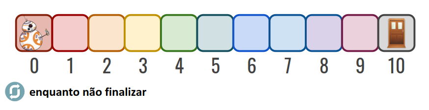

* Laço com critério de parada (teste lógico): <span style = "color:red"> usa quando não se sabe a quantidade de passos.</span>
***

#### Laço com critério de parada (teste lógico)
```
c = 0
while c < 10 :  
    print(c)
    c += 1
```
***

#### Laço com critério de parada (teste lógico)
```
n = 1
while n != 0 :
    n = int(input('Informe um número: '))
print('Fim do laço.')
```
***

#### Laço com critério de parada (teste lógico)
```
resposta = 'S'
while resposta == 'S' :
    n = int(input('Informe um número: '))
    resposta = str(input('Quer continuar [S/N]? ')).upper()
print('Fim')
```
***

#### Exemplo de Estrutura de Repetição Com Teste no Início
```
# Programa que solicita que o usuário digite um número entre 1 e 10
# Repete a solicitação até que o número correto seja digitado
numero = 0
while numero < 1 or numero > 10:
    numero = int(input("Digite um número entre 1 e 10: "))
print("O número digitado foi:", numero)
```
***

# Estrutura de Repetição Com Teste no Final

#### Estrutura de Repetição Com Teste no Final
```
Exemplo em pseudo-código:
    faça
        ação
    enquanto (condição)
```
***

## Exercício 6 
Escreva um programa que leia uma sequência de números inteiros informados pelo usuário e imprima a soma de todos os números **ímpares**, utilizando **while**.
***

## Exercício 7 
Escreva um programa que leia a área de um imóvel. Se ele ultrapassar o limite de 80 m2, deve pagar o IPTU que custa R$ 5 por cada m2. Informe ao usuário se ele é isento de pagamento ou o valor que deve pagar. O programa deve parar a execução se for informado o texto **sair**.
***

## Exercício 8
Crie um programa que receba um número. O número equivale à quantidade de vezes que o programa vai solicitar um valor ao usuário. O valor solicitado deve ser armazenado e a soma dos valores informados deve ser impresso no final do programa. Faça o programa usando os comandos **for** e **while**.
***

## Desafio 1
Escreva um programa que pergunte o valor da casa, o salário do comprador e o prazo de pagamento em meses. Calcule o **valor da prestação** (juros de 10% ao ano), sabendo que ela não pode exceder 30% do salário. O programa deve parar a execução se for informado o texto **sair**.
***

## Extra

<span style = "color:red">Guia de Estilo do Código Python</span> 

https://www.python.org/dev/peps/pep-0008/
***

## Encerramento
* Revisão
* Exercício Complementar
* Próxima Aula
