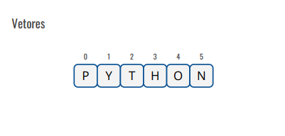
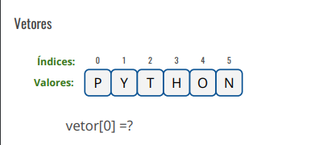
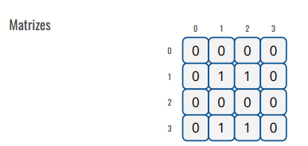
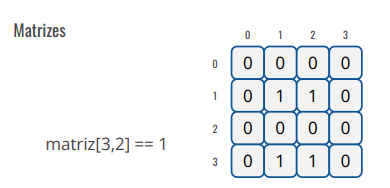
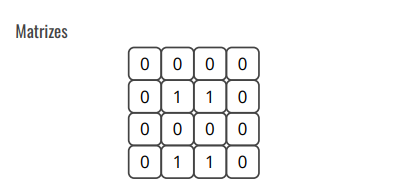
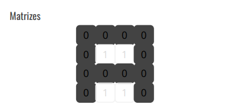
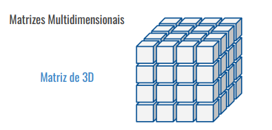
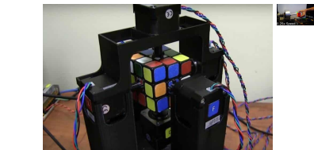

#  Introdução à Programação
#### Aula 06
## Estruturas de Controle Condicional
***
### Agenda
#### - - -

* Vetores
* Matrizes
* Containers
***
# Vetores
***
## Vetores 

***

***

***

***
## Exemplos de Uso de Vetores
* Listas de valores numéricos
* Strings (palavras e textos)
* Vetores de vetores
***
 ## Exemplos de Vetores em Python
    vetor = [10, 20, 30, 40, 50]

    print(vetor[2]) 

 imprime 30
***
## Exemplos de Vetores em Python
Outros exemplos:

    nomes = ["Maria", "João", "Pedro", "Ana"] 

    vazia = []

    misturado = [1, "dois", True, 4.5, [6, 7, 8]]
***
# Matrizes
***

***
## Exemplos de Uso de Matrizes
* jogos: xadrez, dama, jogo da velha, sudoku, cubo mágico, caça palvras 
* Tabelas e Planilhas
* Telas de computador, celular, paineis
***
## Exemplo de Matriz em Python
    matriz = [[1, 2, 3], [4, 5, 6]]
***
# Exercício 1 

Escreva um programa que cre um **vetor** com os números de 1 a 10 e imprima seus valorees 
***
# Exercício 2
Escreva um programa que crie uma matriz de duas 
dimensões e imprima sua matriz transporta.
 
***
# Coteiners 
***

## criando Listas 
    lista_vazia = []

    numeros_primos = [1, 2, 3, 5, 7, 9, 11]

    frutas = ["manga", "banana", "goiaba", "melancia"]

    matriz = [[1, 2, 3], [4, 5, 6], [7, 8, 9]]

    vogais = list("aeiou")
***
## Lista são imutaveis
    frutas = ["manga", "banana", "goiaba"]
    frutas[2] = "abacate"
    frutas.append("sapoti")
    print(frutas)
***
## Ordenação 

    frutas = ["manga", "banana", "goiaba"]
    print(frutas)
    frutas.sort()
    print(frutas)
    frutas.sort(reverse=True)
    print(frutas)
***
## Operações em listas
    frutas = ["manga", "banana", "goiaba"]
    print("manga" in frutas)
    print("melancia" not in frutas)
***
## Operações em listas
    frutas = ["manga", "banana"]
    legumes = ["cenoura", "abobrinha"]
    alimentos = frutas + legumes
    print(alimentos)
    print(len(alimentos))
***
## Operações em listas
    valores = [30, 10, 40, 50, 20]
    print(min(valores))
    print(max(valores))
    frutas = ["uva", "jaboticaba"]
    print(min(frutas))

***
## Operações em listas
    letras = ["a", "b", "c", "a", "b", "a"]

    print(letras.count("a"))

    print(letras[2:5])
***
# Exercício 3
Escreva um programa que
crie uma lista com 5
números inteiros
informados pelo usuário e
imprima a soma de seus
valores
***
# Exercício 4
Escreva um programa que
receba 5 números inteiros
informados pelo usuário e
crie uma lista com esses
valores. Em seguida receba
um valor que deve ser
procurado na lista e retorne
se ele está presente ou não.
***
# Exercício 5
Crie um programa que
receba quantos números o
usuário desejar informar e
coloque-os em uma lista.
Em seguida, o programa
deve apresentar:
a. O tamanho da lista.
b. A lista de valores,
ordenada de forma
crescente e decrescente.
***
# Exercício 6
Crie um programa que
receba uma frase como
parâmetro e imprima uma
lista contendo apenas as
palavras com mais de 4
caracteres.
***
# Exercício 7
Crie um programa que
solicite duas frases ao
usuário e imprima a
quantidade de palavras que
aparecem em ambas as
frases.
***
# Conjunto
***
## Conjuntos 
    conjunto_vazio = set()

    vogais = set("aeiouae")

    nomes = {"joão", "josé", "maria"}
***
## Operções em conjuntos
    nomes = {"joão", "josé", "maria"}

    print("zé" in nomes)

    print(len(nomes))

    print(max(nomes))

***
## Operções em conjuntos
    nomes = {"josé", "francisco", "zeca"}

    apelidos = {"zé", "chico", "zeca"}

    print(nomes.union(apelidos))

    print(nomes.intersection(apelidos))
***
## Operções em conjuntos
    frutas = {"manga", "goiaba"}

    frutas.add("banana")

    frutas.remove("goiaba")

    frutas.discard("goiaba")

    frutas.clear()
***
# Exercício 8 
Escreva um programa que
solicite duas palavras e
retorne as letras que estão
presentes em ambas.
***
# Dicionário
***
## Dicionários
    dicionario_vazio = dict()
    
    outro_dicionario_vazio = { }

    idades = {"joão": 18, "maria": 21, "josé": 25 }
***
## Operações em dicionários
    idades = {"joão": 18, "maria": 21, "josé": 25 }

    print(idades.keys())

    print(idades.get("maria"))

    idades["chico"] = 30

    idades["chico"] = 35

    print(idades.get("chico"))
***
## Operações em dicionários
    idades = {"joão": 18, "maria": 21, "josé": 25 }

    print(idades)

    idade_jose = idades.pop("josé")

    print(idade_jose)

    print(idades)
***
# Exercício 9
Escreva um programa que
recebe o nome e a idade de
várias pessoas e armazena
essas informações em um
dicionário. Em seguida, o
programa deve exibir a
idade média das pessoas
***
# Exercício 10
Escreva um programa que
recebe nomes de frutas e a
quantidade de cada fruta. O
programa deve exibir o
nome da fruta que possui a
maior quantidade.
***
# Encerramento 
* Revisão
* Exercício Complementar
* Próxima Aula
